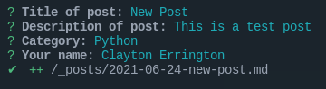

# [Useful Scripting Network](https://usefulscripting.network)

[](https://raw.githubusercontent.com/Useful-Scripting-Network/Useful-Scripting-Network.github.io/master/LICENSE)
[](https://jekyllrb.com/)
[](https://rubygems.org/gems/minimal-mistakes-jekyll)


Useful Scripting Network exists to help you learn programming by finding useful examples and solutions. I've have spent many hours (as one should) searching and stumbling around to find the solution to my problem. I decided to create this as a place to share some experience as well as keep learing by writing new things and showing real life examples of how I resolved an issue. 

This was also built for you to share your thoughts and continue to help those who follow in your footsteps. 

## Theme

This was built on the ever great theme [Minimal Mistakes](https://mmistakes.github.io/minimal-mistakes/). He has made this [Jekyll Theme](https://jekyllrb.com/) with so many great features, and an easy way for others to pitch in and quickly add more posts to our blog. 

## Setup

We welcome your posts and experience in new posts and helping correct previous posts as well.

You will need to have a few things installed first:

1. [Ruby](https://www.ruby-lang.org/en/)
   - [Jekyll](https://jekyllrb.com/) 
   - [Bundler](https://bundler.io/)
2. [NodeJS](https://nodejs.org/en/)

I have added a few ```npm``` scripts to help make some of the setup commands easier. 

1. Clone repo: 
```shell
git clone https://github.com/Useful-Scripting-Network/Useful-Scripting-Network.github.io
```

2. Install NPM dependencies
```shell
npm install
```

3. Install Gem file with pre-built script. Runs ```bundle install```
```shell
npm run postinstall
```

4. Easy start. Runs ```bundle exec jekyll serve```
```shell
npm run serve
```

5. Launch site at [http://127.0.0.1:4000](http://127.0.0.1:4000) to see the site in your browser. 

## Adding new blog posts

I have found the module [PlopJS](https://plopjs.com/) to make the creation of new posts, as they say, Consistency Made Simple. To begin, after the Install and Serve succeed, just run ```npm run newpost``` and fill out the questions.



Please choose just one Categories. Once the post file is created, you can add tags if you'd like. Add them to the `toml` header as `tags: ['tags', 'go', here']`. Tags are used as sub categories in a way on our site. Multiple are allowed here, but just need to be in the `array` format as shown. 

If this is you first time to submit a blog post also edit the `_data/authors.ymal` file and include the follow, as you with: 

```toml
# /_data/authors.yml

Billy Rick: # This is the same name used in the posts section. They need to match
  name        : "Billy Rick"
  bio         : "What do you want, jewels? I am a very extravagant man."
  avatar      : "/assets/images/bio-photo-2.jpg"
  links:
    - label: "Email"
      icon: "fas fa-fw fa-envelope-square"
      url: "mailto:billyrick@rick.com"
    - label: "Website"
      icon: "fas fa-fw fa-link"
      url: "https://thewhip.com"
    - label: "Twitter"
      icon: "fab fa-fw fa-twitter-square"
      url: "https://twitter.com/extravagantman"
```

### Pull Requests

When submitting a pull request:

1. Clone the repo.
2. Create a branch off of `master` and give it a meaningful name (e.g. `my-awesome-new-post`).
3. Open a pull request on GitHub and describe the post.
4. Once merged, your post will be live on the website. 

---

## Credits

## Owner of the site

**Clayton Errington**

- <https://claytonerrington.com>

### Creator of the theme

**Michael Rose**

- <https://mademistakes.com>
- <https://twitter.com/mmistakes>
- <https://github.com/mmistakes>

### Icons + Demo Images:

- [The Noun Project](https://thenounproject.com) -- Garrett Knoll, Arthur Shlain, and [tracy tam](https://thenounproject.com/tracytam)
- [Font Awesome](http://fontawesome.io/)
- [Unsplash](https://unsplash.com/)

### Other:

- [Jekyll](http://jekyllrb.com/)
- [jQuery](http://jquery.com/)
- [Susy](http://susy.oddbird.net/)
- [Breakpoint](http://breakpoint-sass.com/)
- [Magnific Popup](http://dimsemenov.com/plugins/magnific-popup/)
- [FitVids.JS](http://fitvidsjs.com/)
- [GreedyNav.js](https://github.com/lukejacksonn/GreedyNav)
- [Smooth Scroll](https://github.com/cferdinandi/smooth-scroll)
- [Gumshoe](https://github.com/cferdinandi/gumshoe)
- [jQuery throttle / debounce](http://benalman.com/projects/jquery-throttle-debounce-plugin/)
- [Lunr](http://lunrjs.com)

---

## License

The MIT License (MIT)

Copyright (c) 2013-2020 Useful Scripting Network and contributors

Permission is hereby granted, free of charge, to any person obtaining a copy
of this software and associated documentation files (the "Software"), to deal
in the Software without restriction, including without limitation the rights
to use, copy, modify, merge, publish, distribute, sublicense, and/or sell
copies of the Software, and to permit persons to whom the Software is
furnished to do so, subject to the following conditions:

The above copyright notice and this permission notice shall be included in all
copies or substantial portions of the Software.

THE SOFTWARE IS PROVIDED "AS IS", WITHOUT WARRANTY OF ANY KIND, EXPRESS OR
IMPLIED, INCLUDING BUT NOT LIMITED TO THE WARRANTIES OF MERCHANTABILITY,
FITNESS FOR A PARTICULAR PURPOSE AND NONINFRINGEMENT. IN NO EVENT SHALL THE
AUTHORS OR COPYRIGHT HOLDERS BE LIABLE FOR ANY CLAIM, DAMAGES OR OTHER
LIABILITY, WHETHER IN AN ACTION OF CONTRACT, TORT OR OTHERWISE, ARISING FROM,
OUT OF OR IN CONNECTION WITH THE SOFTWARE OR THE USE OR OTHER DEALINGS IN THE
SOFTWARE.

Useful Scripting Network incorporates icons from [The Noun Project](https://thenounproject.com/) 
creators Garrett Knoll, Arthur Shlain, and tracy tam.
Icons are distributed under Creative Commons Attribution 3.0 United States (CC BY 3.0 US).

Useful Scripting Network incorporates [Font Awesome](http://fontawesome.io/),
Copyright (c) 2017 Dave Gandy.
Font Awesome is distributed under the terms of the [SIL OFL 1.1](http://scripts.sil.org/OFL) 
and [MIT License](http://opensource.org/licenses/MIT).

Useful Scripting Network incorporates photographs from [Unsplash](https://unsplash.com).

Useful Scripting Network incorporates [Susy](http://susy.oddbird.net/),
Copyright (c) 2017, Miriam Eric Suzanne.
Susy is distributed under the terms of the [BSD 3-clause "New" or "Revised" License](https://opensource.org/licenses/BSD-3-Clause).

Useful Scripting Network incorporates [Breakpoint](http://breakpoint-sass.com/).
Breakpoint is distributed under the terms of the [MIT/GPL Licenses](http://opensource.org/licenses/MIT).

Useful Scripting Network incorporates [FitVids.js](https://github.com/davatron5000/FitVids.js/),
Copyright (c) 2013 Dave Rubert and Chris Coyier.
FitVids is distributed under the terms of the [WTFPL License](http://www.wtfpl.net/).

Useful Scripting Network incorporates [Magnific Popup](http://dimsemenov.com/plugins/magnific-popup/),
Copyright (c) 2014-2016 Dmitry Semenov, http://dimsemenov.com.
Magnific Popup is distributed under the terms of the MIT License.

Useful Scripting Network incorporates [Smooth Scroll](http://github.com/cferdinandi/smooth-scroll),
Copyright (c) 2019 Chris Ferdinandi.
Smooth Scroll is distributed under the terms of the [MIT License](http://opensource.org/licenses/MIT).

Useful Scripting Network incorporates [Gumshoejs](http://github.com/cferdinandi/gumshoe),
Copyright (c) 2019 Chris Ferdinandi.
Smooth Scroll is distributed under the terms of the [MIT License](http://opensource.org/licenses/MIT).

Useful Scripting Network incorporates [jQuery throttle / debounce](http://benalman.com/projects/jquery-throttle-debounce-plugin/),
Copyright (c) 2010 "Cowboy" Ben Alman.
jQuery throttle / debounce is distributed under the terms of the [MIT License](http://opensource.org/licenses/MIT).

Useful Scripting Network incorporates [GreedyNav.js](https://github.com/lukejacksonn/GreedyNav),
Copyright (c) 2015 Luke Jackson.
GreedyNav.js is distributed under the terms of the [MIT License](http://opensource.org/licenses/MIT).

Useful Scripting Network incorporates [Jekyll Group-By-Array](https://github.com/mushishi78/jekyll-group-by-array),
Copyright (c) 2015 Max White <mushishi78@gmail.com>.
Jekyll Group-By-Array is distributed under the terms of the [MIT License](http://opensource.org/licenses/MIT).

Useful Scripting Network incorporates [@allejo's Pure Liquid Jekyll Table of Contents](https://allejo.io/blog/a-jekyll-toc-in-liquid-only/),
Copyright (c) 2017 Vladimir Jimenez.
Pure Liquid Jekyll Table of Contents is distributed under the terms of the [MIT License](http://opensource.org/licenses/MIT).

Useful Scripting Network incorporates [Lunr](http://lunrjs.com),
Copyright (c) 2018 Oliver Nightingale.
Lunr is distributed under the terms of the [MIT License](http://opensource.org/licenses/MIT).
